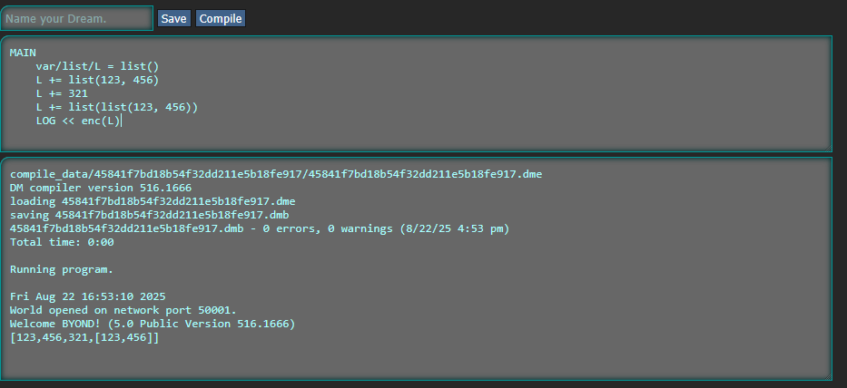
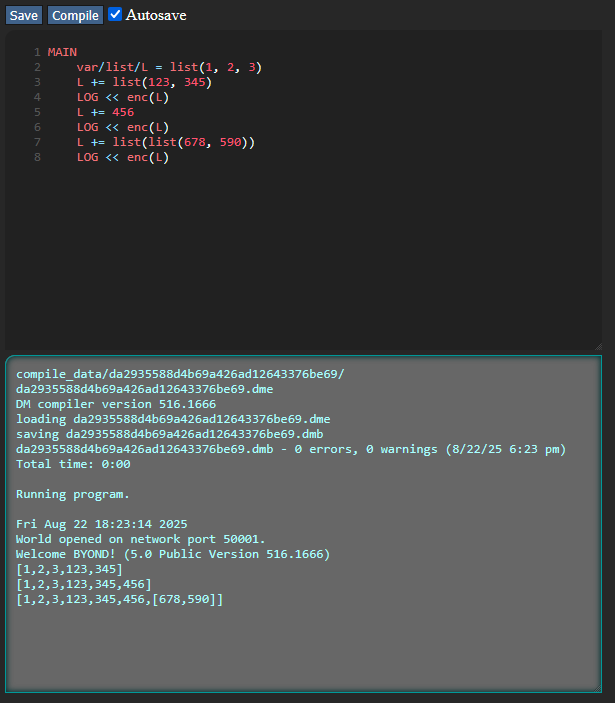

# DreamFeeler FastAPI

FastAPI Interface for testing and interpreting one-file programs for DreamMaker Language.
<!--
MAIN
	var/list/L = list(1, 2, 3)
	L += list(123, 345)
	LOG << enc(L)
	L += 456
	LOG << enc(L)
	L += list(list(678, 590))
	LOG << enc(L)
-->
Legacy:

New:

## Django project (legacy)

Originally this project was written on Django and now I migrated it to Fastapi, because of it's less complicated development workflow.
